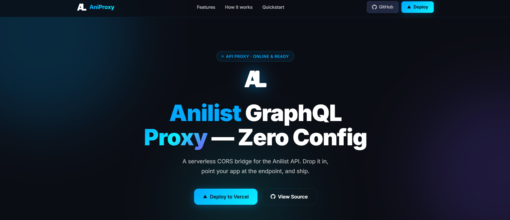
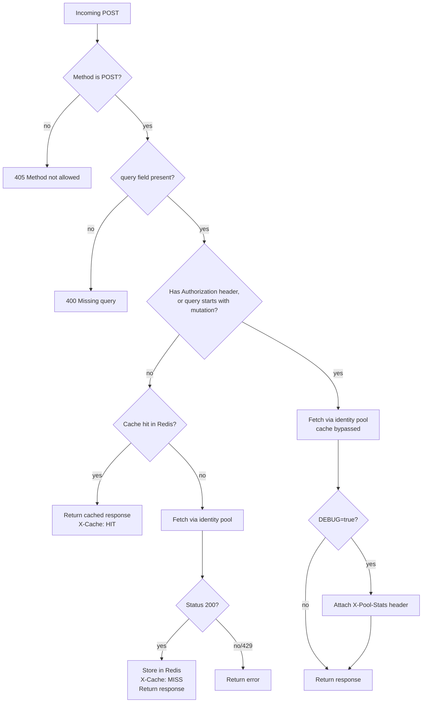

# 🚀 Anilist GraphQL Proxy (AniProxy) v2

> A fast, CORS-enabled serverless proxy for the Anilist GraphQL API with a client-fingerprint pool, automatic 429 retry, and Upstash Redis caching for anonymous queries.  
> Deployable on Vercel in seconds.

[](https://vercel.com/new/clone?repository-url=https%3A%2F%2Fgithub.com%2Faz4if%2FAniProxy)

<details>
<summary>📸 Preview</summary>
<br>



</details>

---

## ✨ What's new in v2

> **v1:** [Itzmepromgitman/Anilist-Api](https://github.com/Itzmepromgitman/Anilist-Api) — 🚀 Anilist GraphQL Proxy, a lightning-fast serverless proxy for the Anilist API. ⚡ Deploy to Vercel in seconds with CORS support, authentication handling, and zero config required. Perfect for anime web apps! 🎌✨

| Feature | v1 | v2 |
|---|---|---|
| CORS support | ✅ | ✅ |
| Auth header forwarding | ✅ | ✅ |
| Local rate-limit tracking | ❌ passthrough | ✅ per-identity, in-memory |
| Client-fingerprint pool | ❌ single identity | ✅ 6 rotating identities |
| Automatic 429 retry | ❌ | ✅ up to 3 retries |
| Exponential back-off | ❌ | ✅ |
| Sliding-window counters | ❌ | ✅ per-identity, 60-second window |
| **Upstash Redis cache** | ❌ | ✅ anonymous queries cached server-side |
| Cache headers | ❌ | ✅ `X-Cache: HIT` / `MISS` (anonymous queries only) |
| Debug pool stats | ❌ | ✅ via `DEBUG=true` |

---

## 🧠 How it works

### Identity pool (per function instance, in-memory)

Every incoming request is handled by one of Vercel's serverless function instances. Within that instance, the proxy keeps a pool of **6 virtual client identities** — each pairing a distinct `User-Agent` with an `Accept-Encoding` value — and tracks a separate in-memory request timestamp list per identity:

```
Identity 0 → Chrome / Windows
Identity 1 → Safari / macOS
Identity 2 → Firefox / Linux
Identity 3 → Edge / Windows
Identity 4 → Safari / iPhone
Identity 5 → Chrome / Android
```

Every incoming request:
1. **Round-robins** through the pool to pick the next identity
2. **Checks** that identity's own 60-second sliding window against a conservative cap (55/min anonymous, 85/min authenticated — AniList's real limits are 60 and 90)
3. **Records** the timestamp in that identity's window
4. **Sends** the request to AniList using that identity's headers

On a **429 from AniList**:
- That identity is marked exhausted for the current request's retry cycle
- The proxy waits — using AniList's own `Retry-After` header if one was sent, otherwise an exponential back-off (300 ms → 600 ms → 1 200 ms)
- It retries on the next non-exhausted identity, up to **3 retries** (4 attempts total) before returning the 429 to the client

> [!IMPORTANT]
> **What this pool does and doesn't do:** the identity pool and its counters are an **in-memory, per-instance, best-effort local throttle**. They are not shared across the multiple serverless instances Vercel may run concurrently, and they reset whenever an instance cold-starts. Rotating the `User-Agent` string also does **not** change the underlying network connection — all 6 identities still go out from the same instance's IP. If AniList's rate limiting keys off IP address or auth token rather than `User-Agent`, the pool does not multiply your real quota with AniList; what it reliably gives you is request pacing and automatic retry/back-off on 429s, not a verified throughput multiplier. Treat any "effective req/min" figure as a theoretical local ceiling, not a guaranteed number against AniList's actual enforcement.

### Upstash Redis caching

Anonymous, non-mutation GraphQL queries are cached in Upstash Redis:

```
Incoming request
      │
      ▼
 Authenticated header present, OR query starts with "mutation"?
      ├── yes → skip cache entirely, go straight to identity pool
      └── no  → compute cache key (djb2 hash of query + variables + operationName)
                     │
                     ├── Redis HIT  → return cached response   (X-Cache: HIT)
                     └── Redis MISS → fetch via identity pool, cache on 200,
                                       return response           (X-Cache: MISS)
```

- Cache entries expire after `CACHE_TTL_SECONDS` (default **5 minutes**).
- Cache reads/writes are wrapped in try/catch — any Redis error is swallowed and the request just falls through to AniList, uncached.
- `X-Cache` is only ever set on this anonymous/non-mutation path. Authenticated requests and mutations don't get an `X-Cache` header at all (there's nothing to report — they always bypass the cache).
- The Redis store is used **only** for response caching, not for rate-limit coordination — see the limitation above.

### Request flow end-to-end



> [!NOTE]
> `X-Pool-Stats` (debug mode) is only attached on the **authenticated/mutation** branch, since that's the only branch that returns *after* the pool-stats block in the code. It is not attached to anonymous cached or cache-miss responses.

---

## 🚀 Quick Deploy

```bash
# 1. Clone
git clone https://github.com/az4if/AniProxy
cd AniProxy

# 2. Install
npm install

# 3. Copy env vars and fill in your Upstash credentials
cp .env.example .env.local

# 4. Deploy
npm run deploy
```

Or click [](https://vercel.com/new/clone?repository-url=https%3A%2F%2Fgithub.com%2Faz4if%2FAniProxy)

---

## 📍 API Endpoints

| Endpoint | Description |
|---|---|
| `POST /api/graphql` | Main GraphQL proxy endpoint |
| `POST /graphql` | Short alias |

---

## 📖 Usage

### Basic Query

```javascript
const response = await fetch('https://your-app.vercel.app/api/graphql', {
  method: 'POST',
  headers: { 'Content-Type': 'application/json' },
  body: JSON.stringify({
    query: `query ($id: Int) {
      Media(id: $id, type: ANIME) {
        id
        title { romaji english }
        episodes
        status
        averageScore
      }
    }`,
    variables: { id: 15125 }
  })
});
const data = await response.json();
// For this anonymous, non-mutation request:
// response.headers.get('X-Cache') → 'HIT' or 'MISS'
```

### Authenticated Request (cache bypassed)

```javascript
const response = await fetch('https://your-app.vercel.app/api/graphql', {
  method: 'POST',
  headers: {
    'Content-Type': 'application/json',
    'Authorization': 'Bearer YOUR_ACCESS_TOKEN'
  },
  body: JSON.stringify({ query: `query { Viewer { id name } }` })
});
// No X-Cache header on this response — authenticated requests always
// skip the cache. With DEBUG=true you'll get X-Pool-Stats instead.
```

---

## 🛠️ Environment Variables

Copy `.env.example` to `.env.local` for local dev, or set these in your Vercel project settings:

| Variable | Default | Required | Description |
|---|---|---|---|
| `PORT` | `3000` | No | Port for `vercel dev` (ignored in production) |
| `ANILIST_API_URL` | `https://graphql.anilist.co/` | No | AniList upstream URL |
| `UPSTASH_REDIS_REST_URL` | — | **Yes**, for caching | Upstash Redis REST endpoint. If unset, caching is silently skipped and every request goes upstream. |
| `UPSTASH_REDIS_REST_TOKEN` | — | **Yes**, for caching | Upstash Redis REST token |
| `CACHE_TTL_SECONDS` | `300` | No | Cache expiry in seconds (default 5 min) |
| `DEBUG` | `false` | No | Set `true` to expose the `X-Pool-Stats` header on authenticated/mutation responses |

> [!WARNING]
> If you're updating from an earlier copy of `.env.example`: the `DEBUG` comment there previously referenced an `X-Rate-Limit-Used` header. The code only ever sets `X-Pool-Stats` — update your local `.env.example` comment to match.

### Getting Upstash credentials

1. Sign up at [console.upstash.com](https://console.upstash.com) (free tier available)
2. Create a new **Redis** database
3. Open the database → **REST API** tab
4. Copy `UPSTASH_REDIS_REST_URL` and `UPSTASH_REDIS_REST_TOKEN` into your env

### Debug mode

With `DEBUG=true`, responses on the **authenticated or mutation** path include:

```
X-Pool-Stats: [{"id":0,"recentRequests":12},{"id":1,"recentRequests":8}, ...]
```

`recentRequests` is each identity's count of timestamps within the current 60-second window, for the function instance that handled the request. Since instances are isolated, this reflects local pool usage only — not global usage across your whole deployment.

---

## 🚨 Error Responses

| Status | Meaning |
|---|---|
| 400 | Missing `query` in request body |
| 405 | Non-POST request (`OPTIONS` is handled separately and returns 200) |
| 429 | All pool identities exhausted after retries against AniList; `Retry-After` header is included only if AniList itself sent one on its last 429 |
| 500 | Upstream network failure or other unexpected error |

---

## 📈 Rate limiting — what's actually enforced

AniList's documented limits:

| Mode | AniList limit |
|---|---|
| Anonymous | 60 req/min |
| Authenticated | 90 req/min |

The proxy paces itself against a slightly lower per-identity threshold (55 / 85) using in-memory sliding-window counters, and retries automatically on a 429 by rotating identities and backing off. What it does **not** do is provide a verified or coordinated increase to AniList's actual per-IP or per-token limit — there's no shared state between concurrent serverless instances, and identity rotation only changes the `User-Agent` header, not the outbound IP. In practice this means:

- Light-to-moderate traffic on a single warm instance will be paced sensibly and recover gracefully from occasional 429s.
- Heavy concurrent traffic across many cold-started instances has no global coordination and could still trigger 429s at AniList's real limit, regardless of what any single instance's local counters say.
- Caching anonymous queries in Redis is the most reliable way to cut real upstream traffic, since a cache hit never touches AniList or the identity pool at all.

---

## 📄 License

Check the [MIT](https://github.com/az4if/AniProxy-v2/blob/main/LICENSE) License
